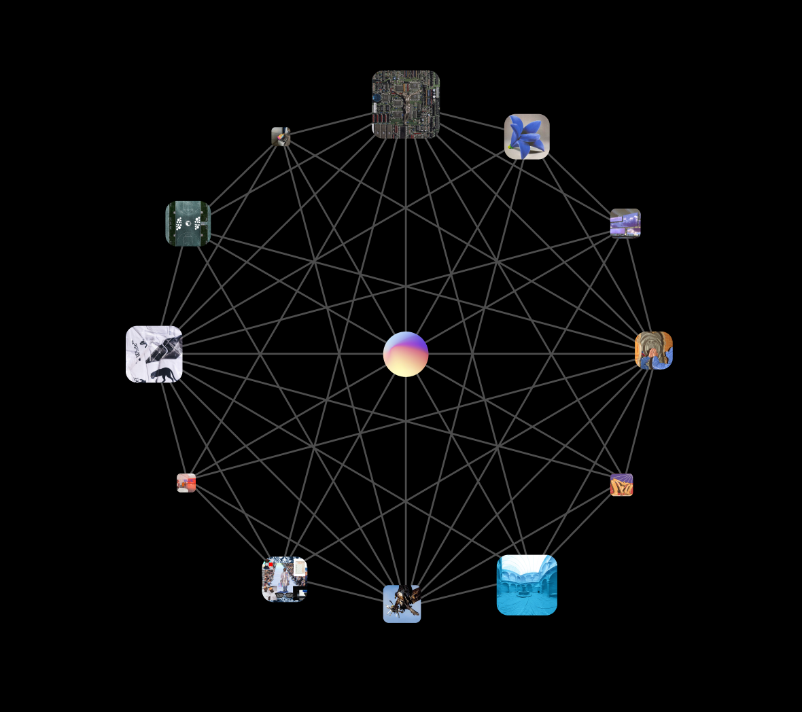
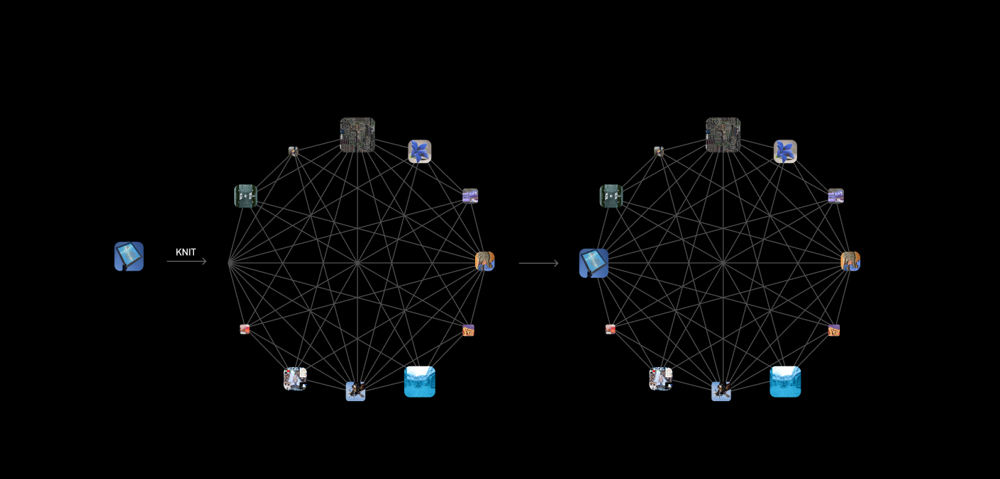
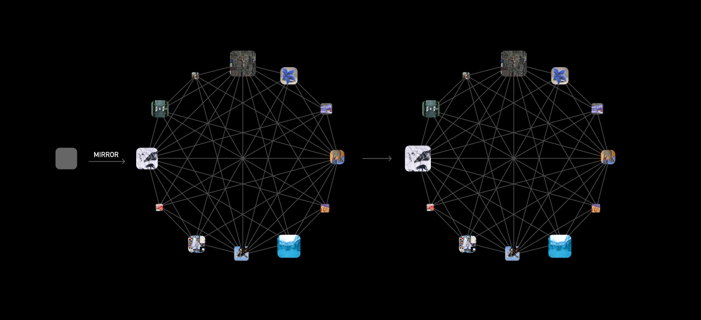
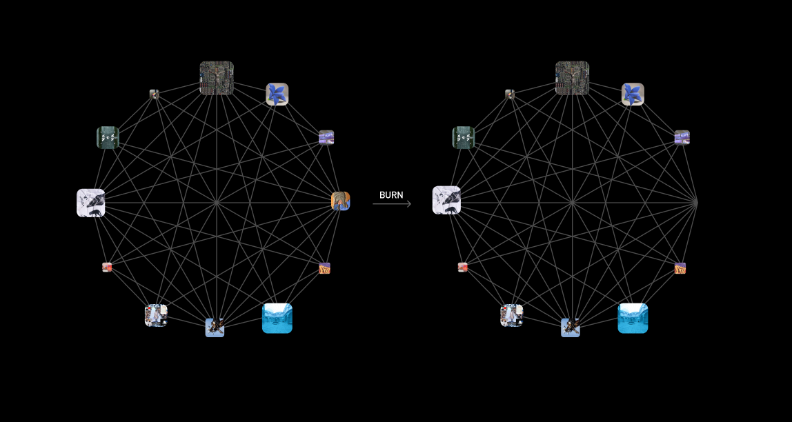

# ARES, a protocol by Verse

ARES (Autonomous Reactive Emissions System) is a hyperimage protocol by Verse.

Hyperimage = [ image ] + [ market ] + [ network ]

Ares rethinks the concept of an "image" from first principles, creating a new internet-native & crypto-native (same thing) medium for images that are more than just static files. In a new internet powered by crypto rails, images are a substrate for memetic coordination. If the web1-web2 era was defined by images that were static, 2D files, Verse believes the next era of the internet will be defined by the hyperimage: an image that is a digital object with a self-contained state, market, and social network programmed into the image itself.

Images = Static, single-player, all value is created by external experiences.

Hyperimages = Dynamic, multiplayer, value accrues to the image by virtue of its internally programmed mechanisms.

The image is the market is the social network.

# Why?

Let's consider how images exist on the internet today. On the modern internet, most images are just static files hosted on some centralized servers. We create and freely distribute these images on large networks like Instagram, YouTube, and Twitter. The problem is that these images have no interally programmed mechanisms to accrue value. Intuitively, it makes sense that an image becomes more valuable as a function of the attention it generates within a demand-constrained attention economy. The more people look at, share, or curate an image, the more valuable it becomes. However, all of these social mechanisms are monopolized by centralized platforms that rent-seek these behaviors and extract much of the value for themselves.

It's imperative to create a new medium for digital images that is decentralized, where value natively accrues to creators and curators as a result of self-sustaining network effects.

# Where do NFTs come into play?

Current NFT implementations have started to solve the problem of native value generation for digital images, but are critically underdeveloped and overly skeuomorphic. Today, the majority of the NFT space looks like this: you mint an NFT, and that's pretty much all the interactivity you have. The NFT is still a static object; All the subsequent curation, economic activity, cultural remixing, and community interaction happens externally to the NFT (in a token-gated discord, on Twitter, etc). 

But what if we actually program the social behaviors & interaction modalities into the NFT itself? Then, we’re operating on a whole new paradigm that is inherently more interactive and powerful. Images are no longer static files, they're living, breathing objects, informational currencies.

# So how does Ares work?

The Ares protocol is a new medium for internet-native images: hyperimages. Hyperimages can be analogized as collectively-created-and-curated image networks; a self-contained state, market, and social network programmed into the image itself. 

Through the protocol, a creator deploys a hyperimage ERC-721 contract with a name and founding image that sets the theme or "brand" of the network. Creators also set the rate at which they want the network to grow (ex: "I want 5 NFTs to be minted from this contract per day at a target price of 1 ETH"). Anyone can then mint a new NFT from this contract. Here's where it gets interesting. At mint time, the minter uploads a new imageURI for the NFT that they mint. The minter is incentivized to add a high quality contribution to the network to drive more attention to the network and draw in subsequent participants. As the attention and cultural relevance around the network grows, demand increases for people to get their creations included in the network. This creates a virtuous cycle of attention and value accrual. The sole purpose of the hyperimage network is to attract attention to itself - similar to any NFT collection. However, the powerful feature here is that the only way to drive value is by adding better content to the network over time. There’s literally only one way to add value to the network, and this constraint serves as a native social interaction that is programmed into the NFT itself.

You don’t have to keep up with 10 different discord channels. You don’t have to participate in governance. You don’t have to argue with other holders over a “roadmap”. You don’t have to rely on an external marketplace to determine asset value. You just create and curate other people’s creations; that’s the only way to proliferate the meme. The mental model here is a shift from being part of a static collection with a bunch of external dependencies to being an active node in a fluid, self-sustaining network. This is a new medium for creative networks that are actually non-skeuomorphic, and crypto-native.

So if I own an NFT from this contract, my NFT's tokenURI will be an image that I contributed to the network (or it might be someone else's tokenURI that I chose to "mirror", but more on that later). So now, I own an image that has an internal state, a market value, and is networked to other images that were created by other people who minted from the contract. 

The internal market will dynamically increase the price to add to the network as demand increases, and lower the price as demand decreases. At any time, token holders can burn their NFT to get ETH in return. However, doing so removes their token's image from the network. This dynamic introduces a critical tradeoff into the decision space: how much does a token holder value their image being part of the network?

# Let's look at an example!

Let's say that my friend Jacob deployed a hyperimage contract titled "Zorbs" with the founding image being a plain zorb. I see this zorb, and have a zorb-ish picture of my own that I want to add to this network. So I mint an NFT from the contract and upload my image. Then, other people see this Zorb meme becoming more popular, and they want to add their own Zorb-inspired images to be part of the network. All of a sudden, we have this collectively-created network of Zorb images where participants are incentivized to keep the meme relevant and growing faster than they're being diluted by the linearly increasing emissions rate. We've created a type of informational currency; a self-sustaining meme economy around the zorb image.

# Mechanisms!
Ares relies on a few fundamental mechanisms to create hyperimages with an internal state, market, and social network.

## State & Network
The bread and butter of a hyperimage contract is the ability for individuals to create/add their own images to the network. The verb used to describe this behavior is "Knit" - analogous to multiple strands of fabric being knitted together to form a cohesive whole. Anyone can call the `knit` function on the contract - this is the primary "create" behavior.

In any network of images, curation is paramount. It would be impossible to have a self-sustaining memetic economy without a way to curate the best creations. Additionally, individuals shouldn't be forced to add something new just to get exposure/participate in the network. This is why the `mirror` function exists. Instead of knitting a new image to the network, I can choose to "mirror" an existing image. Thus, when I mint a new NFT from the contract, my tokenURI will mirror another tokenURI of an existing NFT that I really like. This function creates a native curation system and social behavior within the network, since the best images will be mirrored the most as people want to own them. In web2 terms, you could analogize this behavior as "liking" or "reposting" an image.

## Market

When a creator initially deploys the hyperimage contract, the creator defines a target price and growth rate for the network. For example, in the Zorb example above, the creator might set the target price to 1 ETH and the growth rate to 5 NFTs per day. This means that the contract will dynamically adjust the price to mint a new NFT to try and achieve this schedule, automatically raising and lowering based on demand. 

At any given time, the price to knit or mirror a new NFT from the contract is calculated by the contract. Additionally, current NFT holders can also `burn` their NFT, sending it back to the contract in exchange for the spot price of ETH. Together, these functions create a completely autonomous, self-sustaining market embedded in the hyperimage itself, serving as an on-chain indicator of the image's value as a function of its context and network. 

The ARES protocol is built on the foundation of the [VRGDA](https://github.com/transmissions11/VRGDAs) mechanism. However, ARES introduces fundamental additions to the skeleton of this mechanism, enabling a greater degree of autonomous market dynamics. Specifically, ARES enables individuals to not only buy NFTs from the contract at any time, but also sell and subsequently burn NFTs at any time, receiving ETH in return. Thus, ARES introduces a new type of AMM based on the VRGDA's dynamic pricing system. 

To achieve this behavior, all proceeds from NFT sales are pooled in the contract. When a seller wishes to sell an NFT, the contract quotes the same price as the current spot price to buy an NFT. For example, if the spot price to buy an NFT from the contract was 1 ETH, then a seller would receive the same amount for selling a single NFT back to the contract. 

However, it would be extremely capital inefficient and undesireable to pool all ETH from sales in the contract forever, since the majority of this ETH would never be touched to facilitate autonomous selling. For example, consider a case in which the contract's target price for an NFT sale is 1 ETH, and the target emissions rate is 5 NFTs per day. After 5 days, if sales are proceeding at exactly a perfect pace, 25 ETH will have been pooled and stored in the contract. Now, assume demand drops drastically and all holders seek to sell their NFTs. Each subsequent sale order would yield a lower spot price, because the contract seeks to disincentivize selling and maintain its initally programmed emissions schedule. Thus, each sale would receive an exponentially lower ETH price in return, and the majority of the pooled ETH in the contract would never be touched, even in the limit case of facilitating the sale of all tokens. Thus, for any given point in time, ARES calculates the minimum amount of ETH that would need to be locked in the contract to facilitate the sale of all circulating tokens, and allows the hyperimage creator to withdraw all excess reserves. This allows capital to be efficiently split between rewarding the inital creator while allowing autonomous selling of NFTs. 

Zooming out, one can view the ARES mechanism as a new type of AMM specifically designed for creative networks to grow and evolve in an autonomous, self-sustaining fashion.

# Just Imagine

The Ares protocol reimagines images as internet-native objects. The protocol provides all the infrastructure for digital images to be memetic building blocks that incentivize coordinated creation, curation, and distribution for a new internet powered by crypto rails. We've seen these behaviors already in internet structures like subreddits, hashtags, micronetworks, and meme pages. But we've never seen formal infrastructure designed to weave these behaviors into the fabric of the media itself. When you look at a hyperimage you own in your wallet, you're not just looking at a static image that you own. You're looking at a constantly evolving, dynamic network. You can see the value of the image you own in the context of the network it's a part of. You can see all the other images it's linked to. You can see the meme grow in real time.
